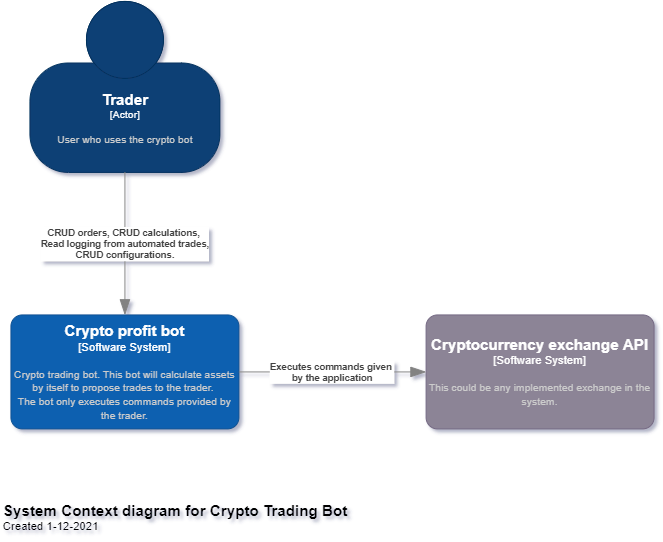
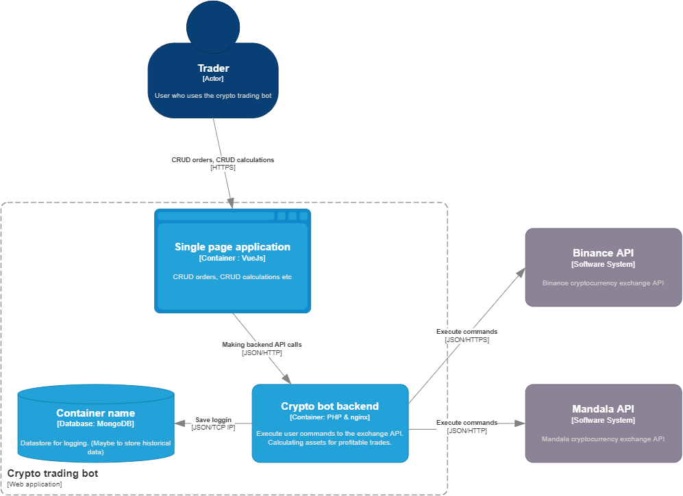

# Software guidebook

##### Author: Raymond de Bruine

## Table of contents
1. [Context](<#Context>)
2. [Functional overview](<#Functional overview>)
   1. [System actors](<#System actors>)
   2. [Userstories](#Userstories)
3. [Quality attributes](<#Quality attributes>)

## Context

This guide is written during the creation of the crypto bot. Ideas, software designs and design descriptions are found 
in this document. This crypto bot is a bot that will keep track of cryptocurrencies from a configured crypto exchange.
The bot will calculate, in first instance with a simple algorithm, to decide which coin is most profitable and 
automatic place trades in that specific cryptocurrency. 

When the system is successfully tested, this bot can be used by other persons which can buy licenses. The plan is to 
sell multiple licenses, with different caps on the trades the users will set.

This application will probably a server/client application with a PHP backend and a VueJS frontend. I've chosen for this
because I will use those languages in the future and this project is to refresh the memory.

## Functional overview

This chapter is split is two segments; the system actors and userstories. The system actors are the users or systems who
are interacting with the system. The userstories describes the interactions of the actors with the system.

### System actors

| Actor | Responsibility |
| --- | ---|
| Trader | CRUD trades, configure calculations to automate |
| Exchange | The exchange which the trader configured. This could be Binance, Mandala or other implemented exchanges |
| News source | Sources to fetch crypto news |

### Userstories

1. As a trader I want to configure a cryptocurrency exchange in the application.
2. As a trader I want to fetch historical data of a crypto asset from the exchange.
3. As a trader I want to predict profitable trades after calculations with historical data of an asset.
4. As a trader I want to place trades for an asset on the exchange. 
5. As a trader I want to fetch news items of a cryptocurrency from multiple news sources.
6. As a trader I want to give permissions to the trading bot. This means that the user can configure if the bot may auto trade or trade after the user has submitted.

### Strategies
- Auto trade between the support and resistance level of an asset. The bot will watch some assets in the exchange and calculate the asset with the highest profit between the support and resistance.

#### Userstories I dream about
1. As a trader I can program my own strategy.

## Quality attributes
non-functional requirements ISO 25010

#### Time behaviour
(I have to think about what is appropriate to make calculations over multiple assets)

#### User error protection
- Errors in the system must be labeled in severity.
- Fatal errors must be communicated to the developers to handle the error.
- Errors in calculations must block all trades to the exchange, to prevent miscalculated trades.
- Errors must be communicated via the frontend to the user to let the user know there is an error and it isn't possible to auto trade.

#### Accessibility

- There is expected that the users of the application have the knowledge to proper use the cryptocurrency.

#### Availability
- Available 24/7. The cryptocurrencies aren't sleeping.

#### Fault tolerance
- When there are severe errors, trading will be made impossible because users can lose much money.
- The system will reset itself, test all functionality and when successfully passed, the bot will pull all active orders (which the bot has made) and calculate them again to prevent faulty trades. 

#### Recoverability
- System recalculates placed orders and cancel them if they are faulty.

#### Confidentiality
- Users need to input their API keys into the system. The need to be saved somewhere. I need to think about this.
- Users need to insert trusted ip-addresses to use the application. Users can only place trades from known ip-addresses.

#### Non-repudiation
- All user input will be logged.
- All bot placed trades will be logged and displayed to the user.

#### Authenticity
- User action can only be performed from trusted ip-addresses.

#### Modularity
- Implementing multiple exchanges must be easy. There are design pattern that solves this problem.

#### Testability
- All trading strategies and calculations provided by the bot must be tested with historical data. 
- They need to be tested everytime the system resets. To ensure data quality.

## Constraints
- The backend of the application is written in PHP.
- The frontend of the application is written in VueJs.

## Principles
- Coding style guides are followed by the PSR-1 and PSR-12 standards.
- The system have to log by the PSR-3 standards.
- Code has to be tested, the strategies and calculations need to have a 100% coverage on public functions.
- Each class and functions has PHPdoc, given by phpStorm.

## Deployment
| Technology | Version | Responsibility |
| --- | --- | --- |
| Nginx | 1.21.4 | Webserver |
| PHP | 8.0.13| Backend |
| VueJS|  | Frontend |
| MongoDB/MySQL |  | Database |

## Software Architecture

To display the architecture of the software, the [C4-model](https://c4model.com/) will be used. For sake of time and 
motivation class diagrams/sequence diagrams will be ignored. Unless there is a complicated issue with design decisions
there will be class diagrams/sequence diagrams and an explanation why this is implemented.

### Context diagram

The trader can perform CRUD actions on orders/trades. The trader can configure assets to trade automatically by the bot. 
The trader has to set a profit/loss limit to automate the trades.
The application will calculate (in first form by support/resistance) the assets on the exchange and let the trader know which asset is the most profitable. (by push 
notification or something).
The bot will execute the commands to the API of the exchange. 

### Container diagram

### Component diagrams

## Code 
Any implementation details?

